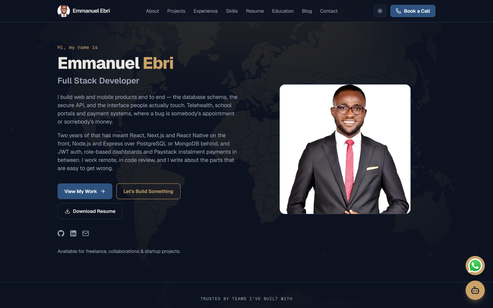
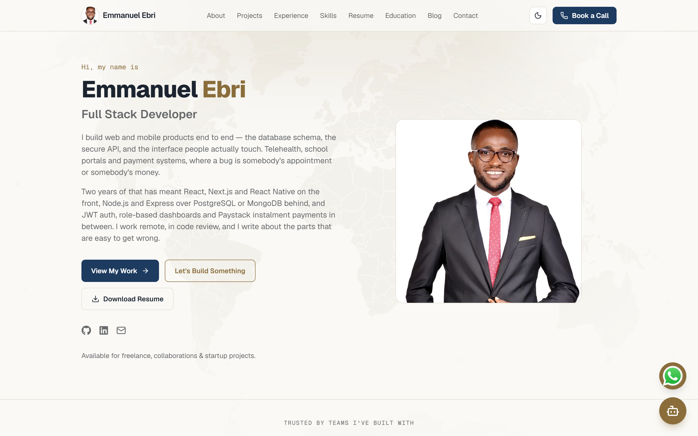
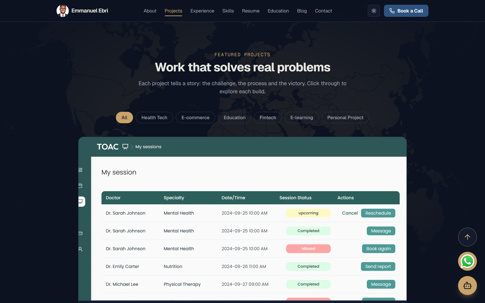
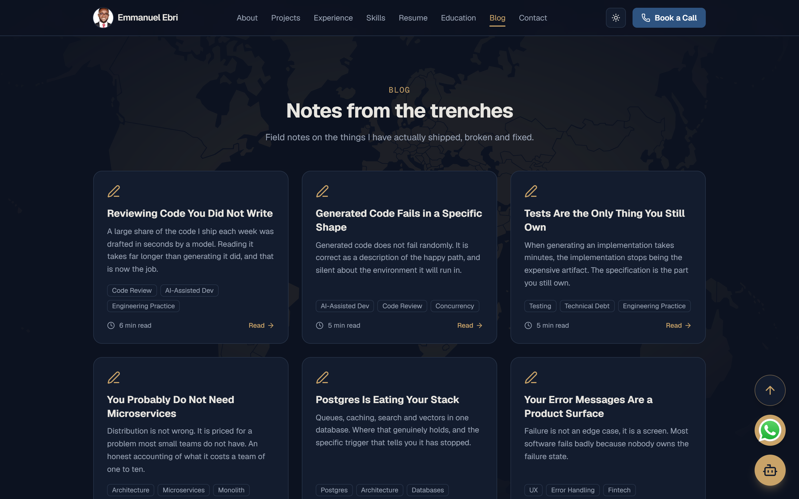
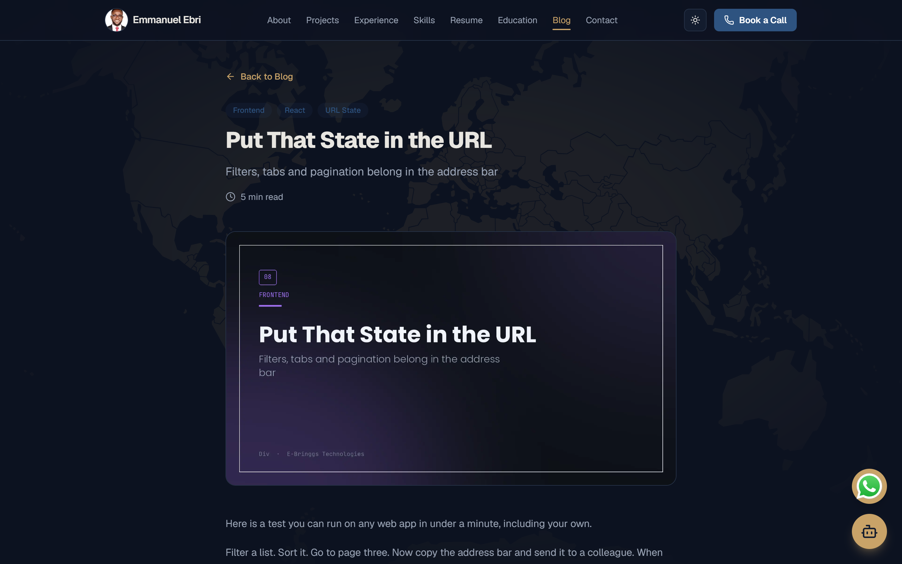
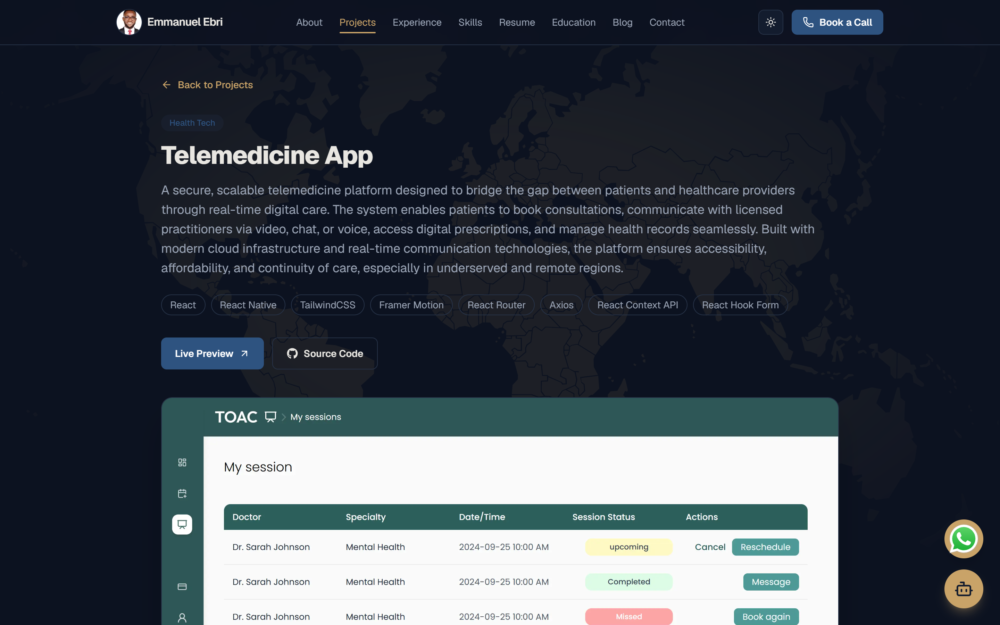
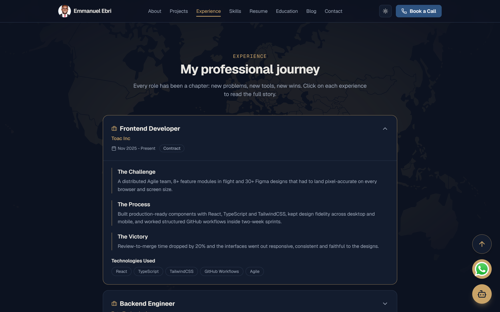
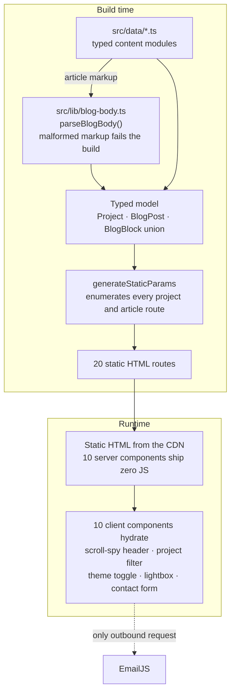

# emmanuelebri.dev

> Personal Portfolio site for a full stack developer: 6 project case studies,
> 10 long-form articles, and a two-theme design system — every route pre-rendered
> to static HTML from typed data, with client JavaScript confined to the parts
> that actually move.

**Live:** https://www.emmanuelebri.dev · **Source:** https://github.com/emmybest19/my-portfolio



|  |  |
| **Light theme** — the same tokens, redefined | **Projects** — filterable, six case studies |
|  |  |
| **Blog** — ten articles | **Article page** — cover, pull quotes, zoomable code |
|  |  |


## Why this exists

A portfolio has one job: convincing someone to start a conversation. Most fail
at it twice over — they look like the template they were forked from, and they
flatten a year of work into a grid of thumbnails with a tech-stack pill under
each one. The work I do spans healthcare, education, fintech and e-commerce, and
what makes it worth reading is the detail: why a monorepo, why the payment
webhook is idempotent, what broke first. That needs case study pages with room
to argue, and articles that stand on their own — not a carousel.

The engineering constraints followed from that. **Content is typed TypeScript,
not a CMS or a markdown pipeline** — `src/data/*.ts` holds every project,
article, role and skill, so a malformed entry is a build error rather than a
blank section discovered in production. **Every dynamic route is enumerated at
build time** through `generateStaticParams`, so all 20 routes ship as static
HTML with no runtime data fetching and no database behind them. **Client
JavaScript is opt-in**: 10 of 20 components declare `"use client"` — the
scroll-spy header, theme toggle, contact form, image light-box, filters and
assistant — and the rest render on the server and ship none. **Light and dark
are one token set, not two stylesheets**: every colour is a CSS custom property
redefined under a `.dark` class, so a new colour is added once.

## Features

- 📚 6 project case studies, each generated from a typed data entry — adding work never touches layout code
- ✍️ 10 long-form engineering articles with headings, pull quotes and zoomable code figures
- 🎨 Navy-and-bronze token system with light and dark built as equals, no flash on first paint
- 🧭 Scroll-aware navigation tracking the section you are reading via `IntersectionObserver`
- 🖼️ Lightbox on screenshots and code figures, because code images are illegible at mobile width
- 📬 Contact form wired straight to EmailJS — no backend, no serverless function
- ⚡ All 20 routes prerendered to static HTML at build time
- ❌ No automated test suite yet — see [Testing](#testing)

## Architecture



Three route groups sit on the App Router: the home route composing eleven
section components, `/projects/[id]`, and `/blog/[slug]`. Both dynamic segments
read from typed modules in `src/data/`, enumerate themselves through
`generateStaticParams`, and prerender at build. The type system is the
architecture here rather than a validation layer bolted on top: article bodies
are authored as a small in-house markup — blank-line-separated blocks, `## ` for
headings, `> ` for pull quotes, `[figure]` for the code screenshot — and parsed
**once at build** into a `BlogBlock` discriminated union, so a mistyped heading
or a stray second figure is a build failure rather than a block that quietly
renders as body text. The renderer switches over that union and closes with
`assertNever`, which makes an unhandled block kind a compile error. Project
categories work the same way, derived from a `const` tuple so a typo cannot
invent a new filter. There is no API layer, no database and no auth, which is
the point: the whole site is a static artifact.

TODO() — write `docs/architecture.md` and link it here.

## Tech stack

| Layer | Choice | Why |
| --- | --- | --- |
| Framework | Next.js 16 (App Router) | Prerenders every route with server components as the default, making interactivity a deliberate opt-in |
| UI | React 19 | Server Components and `async` pages without a compatibility shim |
| Language | TypeScript 5 | Content is typed data — a malformed project entry fails the build instead of rendering an empty section |
| Styling | Tailwind CSS v4 | Design tokens declared as CSS custom properties in one `globals.css`; no `tailwind.config` to keep in sync |
| Theming | next-themes | Class-based dark mode with no flash of the wrong theme on first paint |
| Fonts | Geist Sans + Mono | Self-hosted through `next/font`, so page load makes no third-party request |
| Icons | lucide-react + react-icons | lucide for interface glyphs, react-icons for the brand marks it does not carry |
| Media | next/image + yet-another-react-lightbox | Format and size negotiation on every image, plus zoom for code screenshots that are unreadable on a phone |
| Contact | @emailjs/browser | Submits from the browser directly, keeping the site a static artifact with no backend to operate |
| Hosting | Vercel | Static output, a preview deploy per branch, and apex → www handled in `vercel.json` |

## Running locally

```bash
git clone https://github.com/emmybest19/my-portfolio.git && cd my-portfolio
npm install
npm run dev              #http://localhost:3000
```

No `.env` file, database or container is required — the site reads entirely from
`src/data/`. The EmailJS identifiers in `src/data/site.ts` are publishable
browser keys and are committed deliberately.

```bash
npm run build            # type-checks and prerenders all routes
npm run lint             # eslint
```

## Testing

There is no automated test suite. The gates today are `npm run lint` and
`npm run build`, which type-checks the project and fails on any route that
cannot prerender — enough for a site whose content is static and typed, and not
enough the moment behaviour lands in it.

TODO() — decide the first tests to write. The two that would earn their place:
the article body parser in `src/app/blog/[slug]/page.tsx`, and a build-time
assertion that every `cover`, `figure.src` and project `image` path resolves to
a real file under `public/`.

## Documentation

- Architecture — TODO() `docs/architecture.md`
- Content model (`src/data/*.ts`) — TODO() `docs/content-model.md`
- Article markup format — TODO() `docs/article-format.md`
- Theming and design tokens — TODO() `docs/theming.md`
- Deployment and redirects — TODO() `docs/deployment.md`
- Decision log — TODO() `docs/decisions.md`

## License

TODO() — no licence chosen and no `LICENSE` file in the repository.

© Emmanuel Ebri
